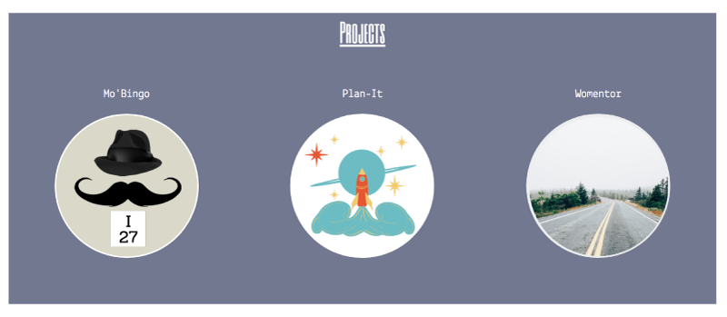
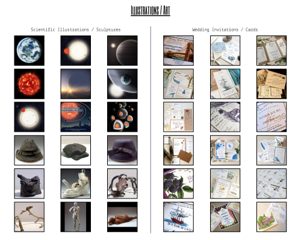

<h1>My Portfolio Page </h1>

A responsive React web application: React, JavaScript, HTML, CSS, Bootstrap

 
 

A visitor can change the page by clicking on the dot in the upper left corner

 
 

Click on the project that you'd like to explore

 
 

Thumbnails of past artwork

 
 

Thank you for visiting